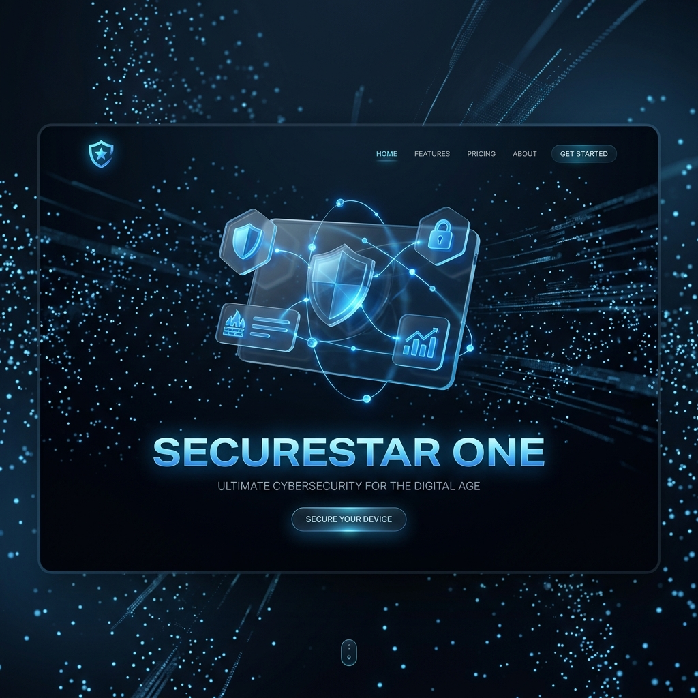
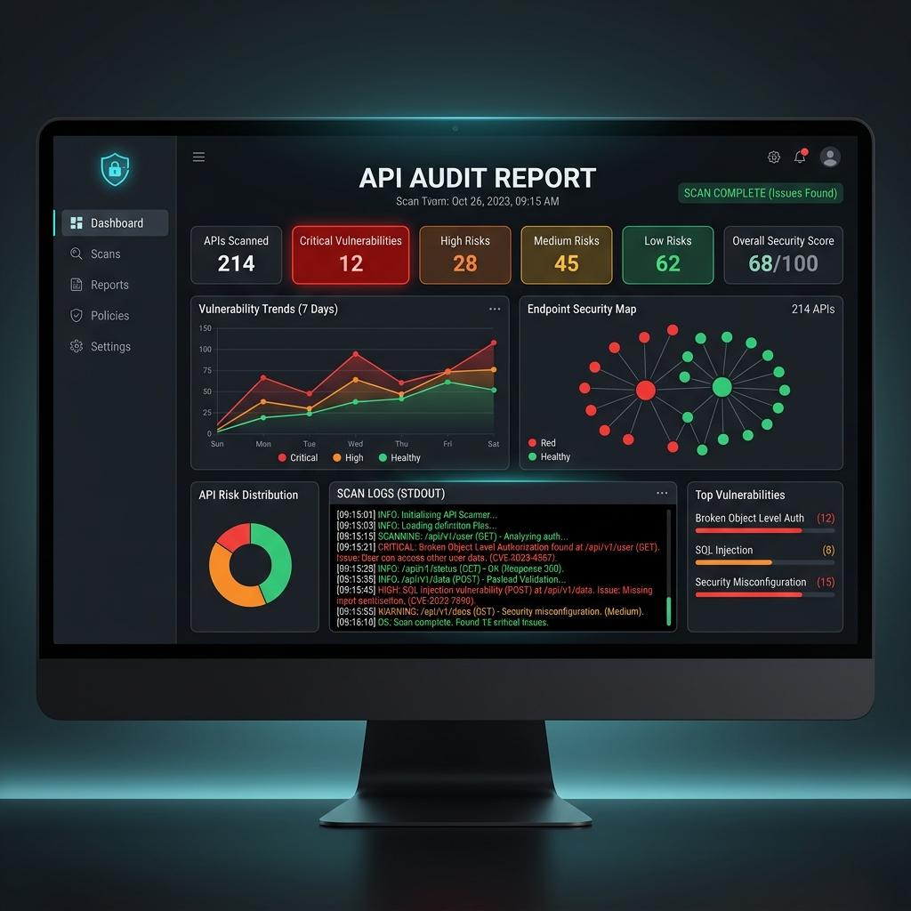

# 🛡️ SecureStar One: Next-Gen API Security Intelligence
**Prepared by Asif** | *Empowered by Antigravity AI*

SecureStar One is a state-of-the-art API security suite designed specifically for large-scale physical infrastructures such as sporting venues and smart stadiums. It leverages high-reasoning AI to provide autonomous vulnerability detection and remediation guidance.

---

## 🏗️ System Architecture

---

## 📸 visual Interface

*Figure 1: Immersive 3D Spatial Landing Page with Three.js*

*Figure 2: AI-Powered Audit Report with Pass/Fail Visualization*

> [!NOTE]
> Please replace the placeholder images above with your actual screenshots (`screenshot1.png`, `screenshot2.png`) for final presentation.

---

## 🚀 Why SecureStar One?
Physical event venues rely on thousands of real-time data points (ticketing, IoT, crowd flow). A single compromised API can lead to catastrophic security breaches. SecureStar One provides:
- **Zero-Trust Validation**: Every endpoint is audited against OWASP Top 10.
- **Spatial Intuition**: Modern Zero-UI design ensures complex data is easy to parse.
- **Context-Aware Chat**: Directly consult with the AI about specific hardware-software API integrations.

---

## 💰 Business Value & ROI

| Metric | Traditional Manual Audit | SecureStar One (AI) |
| :--- | :--- | :--- |
| **Operational Cost** | $65,000+ / Cycle | **~$500 (API Usage)** |
| **Audit Time** | 2-3 Weeks | **Minutes** |
| **Manpower Required** | 5-Person Team | **1 Operator** |
| **Reliability** | Human Error Prone | **Consistent High-Reasoning AI** |

- **Direct Savings**: Estimated **$50,000 - $75,000** savings per security lifecycle.
- **Productivity**: **1000% increase** in testing frequency, moving from annual audits to daily scans.
- **Risk Mitigation**: Drastically reduces insurance premiums by maintaining a verified "Hardened API" status.

---

## 🛠️ Technical Stack
- **Core Engine**: Python 3.9+ / FastAPI
- **LLM Intelligence**: `nvidia/nemotron-3-super-120b-a12b:free` (via OpenRouter)
- **Frontend Dashboard**: Gradio (Mounted within FastAPI)
- **Spatial Landing Page**: Three.js / Tailwind CSS / Glassmorphism
- **Deployment**: Architecture-ready for Google Cloud Run / Docker

---

## 🔮 The Future of AI in API Security
The next phase of SecureStar One aims to implement:
1.  **Autonomous Self-Healing**: AI that automatically generates and pushes security patches to the backend.
2.  **Predictive Attack Simulation**: LLMs mimicking hacker behavior to find "Zero-Day" flaws before they exist.
3.  **Real-Time API Traffic Shielding**: Live-monitoring of API requests with instant AI-driven blocking of malicious patterns.

---

## 👨‍💻 Prepared by
**Asif**  
*Special thanks to the Antigravity Team for the agentic development support.*

---
*© 2026 SecureStar One Labs. Securing the world, one endpoint at a time.*
