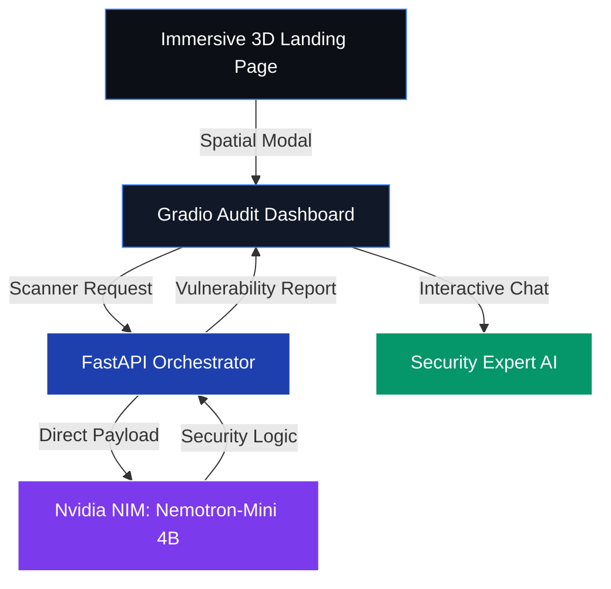
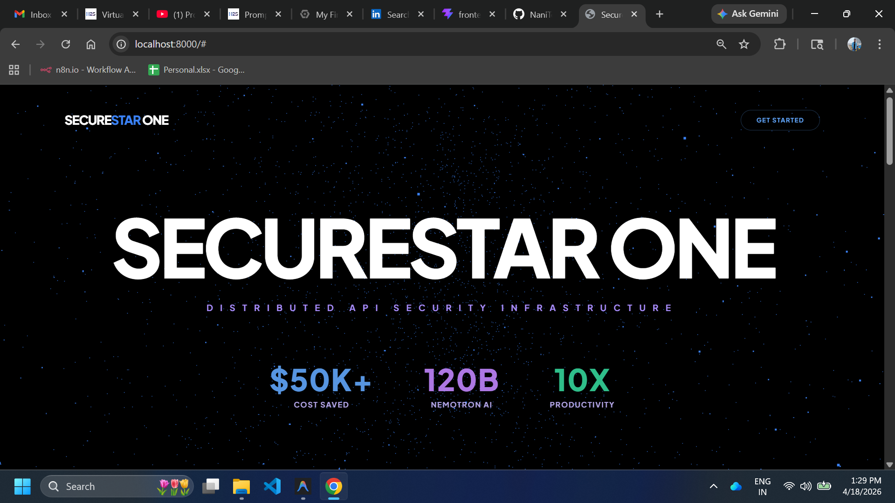
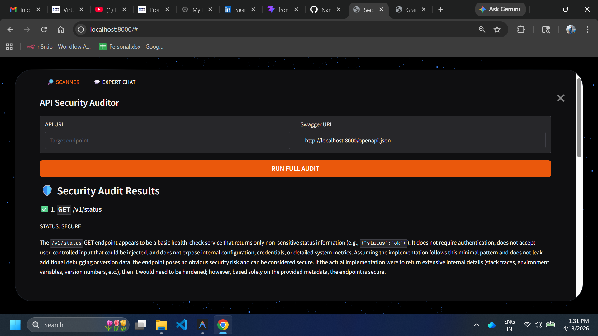
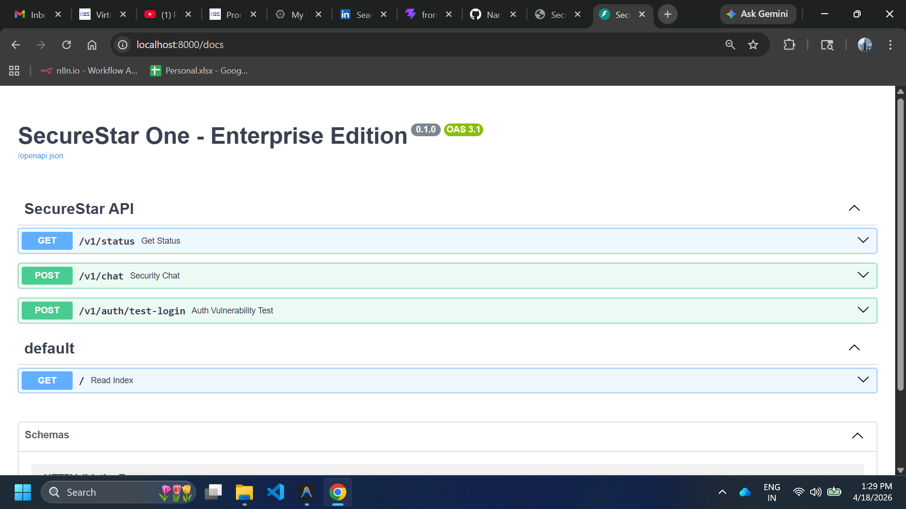

# 🛡️ SecureStar One: Next-Gen API Security Intelligence
**Prepared by Asif** | *Empowered by Antigravity AI*

### 🌐 [Vercel Live Demo Link](https://secure-star-one.vercel.app/)
### 🌐 [GCP Live Demo Link](https://securestar-one-1034435897603.us-central1.run.app/)
---

SecureStar One is a state-of-the-art API security suite designed specifically for large-scale physical infrastructures such as sporting venues and smart stadiums. It leverages high-reasoning AI to provide autonomous vulnerability detection and remediation guidance.

---

## 🏗️ System Architecture



---

## 📸 visual Interface


*Figure 1: Immersive 3D Spatial Landing Page with Three.js*


*Figure 2: AI-Powered Audit Report with Pass/Fail Visualization*


*Figure 3: Swagger API Documentation*

> [!NOTE]
> Please replace the placeholder images above with your actual screenshots (`main.png`, `apitest.png`, `APIs.png`) for final presentation.

---

## 🚀 Why SecureStar One?
Physical event venues rely on thousands of real-time data points (ticketing, IoT, crowd flow). A single compromised API can lead to catastrophic security breaches. SecureStar One provides:
- **Nvidia NIM Intelligence**: Direct integration with Nvidia infrastructure for low-latency audits.
- **Zero-Trust Validation**: Every endpoint is audited against OWASP Top 10.
- **Spatial Intuition**: Modern Zero-UI design ensures complex data is easy to parse.

---

## 💰 Business Value & ROI

| Metric | Traditional Manual Audit | SecureStar One (Nvidia) |
| :--- | :--- | :--- |
| **Operational Cost** | $65,000+ / Cycle | **Minimal Cloud Usage** |
| **Audit Time** | 2-3 Weeks | **Minutes** |
| **Manpower Required** | 5-Person Team | **1 Operator** |
| **Reliability** | Human Error Prone | **Consistent Nvidia Logic** |

- **Direct Savings**: Estimated **$50,000 - $75,000** savings per security lifecycle.
- **Productivity**: **1000% increase** in testing frequency.

---

## 🛠️ Technical Stack
- **Core Engine**: Python 3.9+ / FastAPI
- **LLM Intelligence**: `nvidia/nemotron-mini-4b-instruct` (Direct Nvidia NIM)
- **Frontend Dashboard**: Gradio (Mounted within FastAPI)
- **Spatial Landing Page**: Three.js / Tailwind CSS / Glassmorphism
- **Deployment**: Architecture-ready for Google Cloud Run / Vercel

---

## 🔮 The Future of AI in API Security
The next phase of SecureStar One aims to implement:
1.  **Autonomous Self-Healing**: AI that automatically generates and pushes security patches to the backend.
2.  **Predictive Attack Simulation**: LLMs mimicking hacker behavior to find "Zero-Day" flaws before they exist.
3.  **Real-Time API Traffic Shielding**: Live-monitoring of API requests with instant AI-driven blocking of malicious patterns.

## 🚀 Deployment (Google Cloud Run)

To host **SecureStar One** on your own Google Cloud environment:

1. **Prerequisites**: [Install GCloud SDK](https://cloud.google.com/sdk/docs/install) and run `gcloud auth login`.
2. **Setup Project**:
   ```bash
   gcloud config set project [YOUR_PROJECT_ID]
   gcloud services enable run.googleapis.com cloudbuild.googleapis.com
   ```
3. **One-Command Deploy**:
   ```bash
   gcloud run deploy securestar-one --source .
   ```
4. **Configure Environment Variables**:
   ```bash
   gcloud run services update securestar-one --set-env-vars OPENROUTER_API_KEY=your_key_here
   ```

---

## 👨‍💻 Prepared by
**Asif**  
*Special thanks to the Antigravity Team for the agentic development support.*

---
*© 2026 SecureStar One Labs. All Rights Reserved by Asif.*
